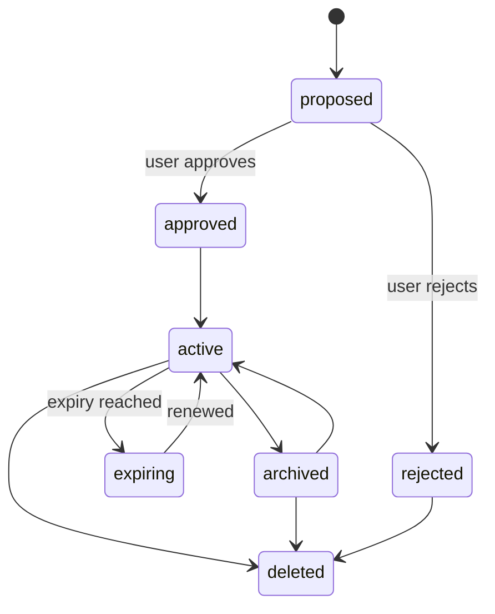
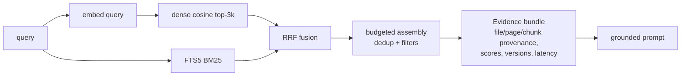
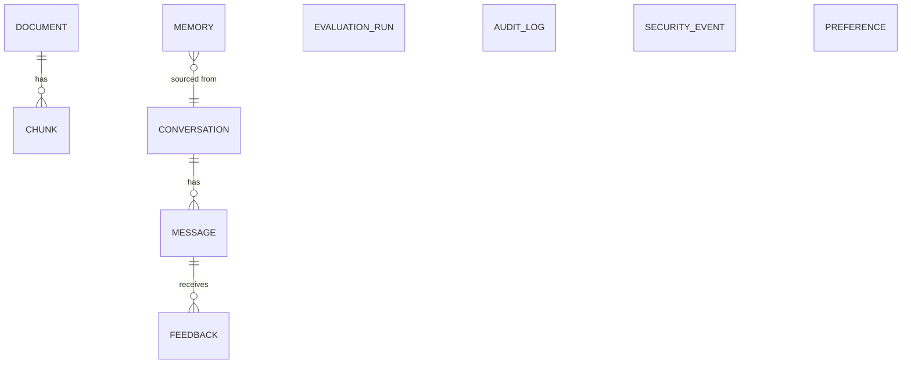

# Architecture Overview

```mermaid
flowchart LR
    subgraph Local Machine
        UI[REST clients / future dashboard] --> API[FastAPI /api/v1]
        API --> ING[Ingestion\nparse->hash->chunk]
        API --> RET[Hybrid Retrieval\ndense + BM25 + RRF]
        API --> ORC[Chat Orchestrator]
        API --> MEM[Memory Lifecycle]
        API --> PREF[Preferences]
        API --> FB[Feedback]
        API --> EVAL[Evaluation]
        ORC --> RET
        ORC --> MEM
        ORC --> PREF
        ORC --> LLM[LLM Adapter\nmock | ollama loopback]
        ING --> DB[(SQLite + FTS5)]
        RET --> DB
        RET --> VIX[(Dense index .npz)]
        MEM --> DB
        NG[Network Guard\nsocket + DNS patch] -. blocks .-> WAN((Internet))
    end
```

## Memory lifecycle

Invariant (test-enforced): only `active` memories are retrievable.

## RAG pipeline


## ER diagram (core)

